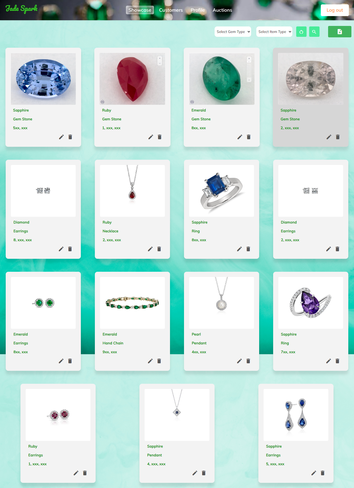

# Jewellery Collection Project

## Overview

Welcome to the Jewellery Collection project! This project is designed to help you manage and showcase your jewellery collection. The backend of the project is built with Flask, a lightweight web framework for Python, while the frontend is developed using Angular, a popular TypeScript-based web application framework.

## Features

- **User Authentication**: Securely manage your jewellery collection by allowing users to sign up, log in, and log out.

- **CRUD Operations**: Perform basic CRUD (Create, Read, Update, Delete) operations on your jewellery items.

- **Search and Filter**: Easily search and filter your jewellery collection based on various attributes.

## Technologies Used

### Backend

- **Flask**: A micro web framework for Python.
- **SQLAlchemy**: An SQL toolkit and Object-Relational Mapping (ORM) library for Python.

### Frontend

- **Angular**: A TypeScript-based open-source web application framework.
- **Angular Material**: A UI component library for Angular applications.

## Getting Started

### Prerequisites

- Ensure you have Python installed. You can download it from [python.org](https://www.python.org/).
- Install Flask using `pip install Flask`.
- Install required Python packages using `pip install -r requirements.txt`.
- Install Node.js and npm from [nodejs.org](https://nodejs.org/).
- Install Angular CLI using `npm install -g @angular/cli`.

### Setting up the Backend

1. Navigate to the `backend` directory.
2. Run `flask run` to start the Flask server.

### Setting up the Frontend

1. Navigate to the `frontend` directory.
2. Run `npm install` to install dependencies.
3. Run `ng serve` to start the Angular development server.

Visit `http://localhost:4200` in your browser to access the Jewellery Collection application.
